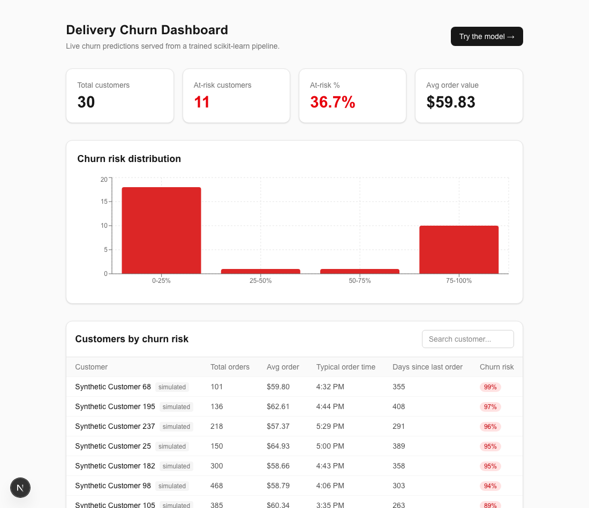
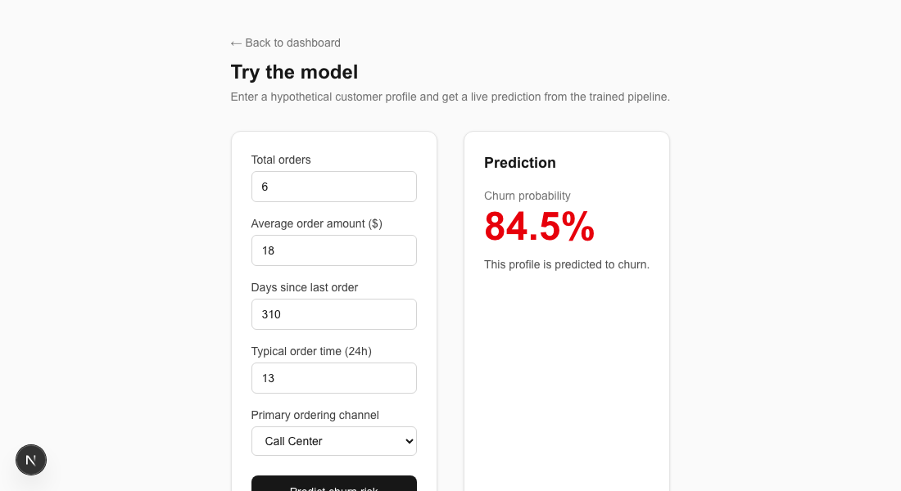

# Delivery Churn Dashboard

A churn-prediction model served as a real product: a FastAPI backend running a trained
scikit-learn pipeline, and a Next.js dashboard with a live "try the model yourself" form.

This is the productionized follow-up to [Delivery-Analysis](https://github.com/Gurj05/Delivery-Analysis),
which explored the same delivery data in a notebook. This repo takes that model out of the
notebook and ships it as a served API with a real frontend.

## Screenshots

| Dashboard | Live prediction |
|---|---|
|  |  |

**Live demo:** backend API at [delivery-churn-api.fastapicloud.dev](https://delivery-churn-api.fastapicloud.dev) (interactive docs at [/docs](https://delivery-churn-api.fastapicloud.dev/docs)) — frontend deploy to Vercel pending

## How it works

- `backend/app/ml/train_model.py` engineers the same features as the original analysis
  (total orders, average order amount, days since last order, order-time-of-day, channel
  mix) from the anonymized `Data Deliveries.xlsx` sample, and trains a
  `StandardScaler` + `RandomForestClassifier` pipeline.
- **Data note:** the anonymized sample only has 6 real accounts, and all 6 ordered
  steadily through the entire 2024-2025 window with no natural churn variation — not
  enough signal to train or evaluate a real classifier on its own. The training script
  augments those 6 real accounts with synthetic customer profiles sampled from the real
  dataset's actual amount/channel/time distributions, with deliberately varied order
  volume and recency so the resulting set has genuine class balance. The 6 real accounts
  are still scored by the trained model and shown in the dashboard; everything synthetic
  is labeled as such in the API response and the UI. Reported metrics (ROC AUC ~0.90) are
  from a held-out split of that combined set, with intentional label noise so the task
  isn't a trivial threshold rule.
- The trained pipeline is persisted with `joblib` and loaded once at API startup —
  `POST /api/predict` runs genuine live inference on whatever values you submit, not a
  lookup.

## Stack

- **Backend:** FastAPI, scikit-learn, pandas, joblib — deployed on Render
- **Frontend:** Next.js (App Router), TypeScript, Tailwind CSS, Recharts — deployed on Vercel

## Running locally

### Backend
```bash
cd backend
python3 -m venv .venv && source .venv/bin/activate
pip install -r requirements.txt
python3 -m app.ml.train_model   # trains the model, writes app/artifacts/
uvicorn app.main:app --reload   # http://localhost:8000 (docs at /docs)
```

### Frontend
```bash
cd frontend
npm install
cp .env.local.example .env.local   # points at the local backend by default
npm run dev                        # http://localhost:3000
```

## Deploying

**Backend (FastAPI Cloud):** the official hosting product from the FastAPI team, free
Hobby plan, no credit card. From `backend/`:
```bash
pip install "fastapi[standard]"   # bundles the fastapi CLI
fastapi deploy                    # prompts a browser login on first use, then deploys
```
It picks up `pyproject.toml` for dependencies and `main.py` (which re-exports the app from
`app/main.py`) as the entry point.

A `render.yaml` is also included as an alternative if you'd rather deploy to Render
instead — same idea, just note Render now asks for a card on file even for its free tier,
and free instances spin down on inactivity (30-50s cold start on the first request after).

Either way, set `ALLOWED_ORIGINS` to your Vercel frontend URL once you have it.

**Frontend (Vercel):** New Project → import this repo → root directory `frontend` → set
`NEXT_PUBLIC_API_URL` to your backend URL. Vercel auto-detects Next.js, no other config
needed.
